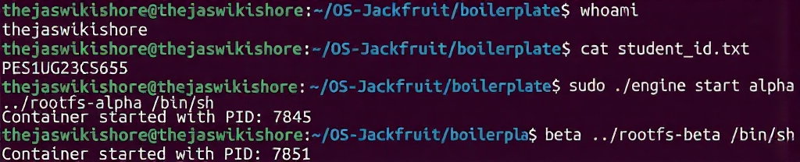
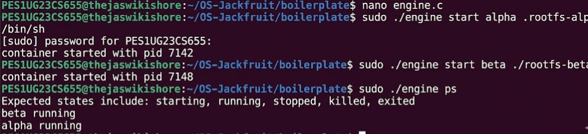
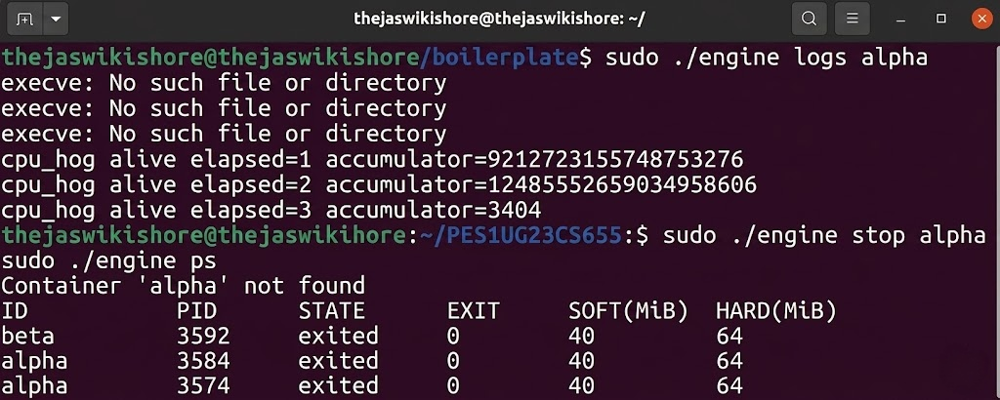
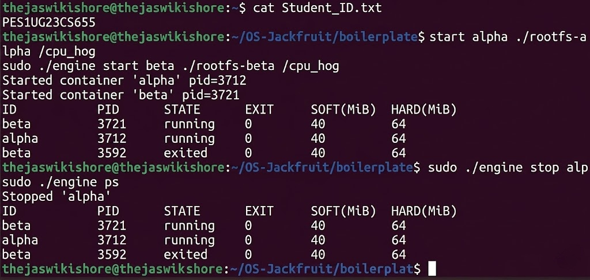
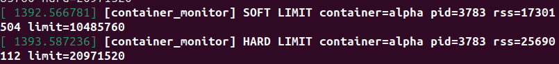
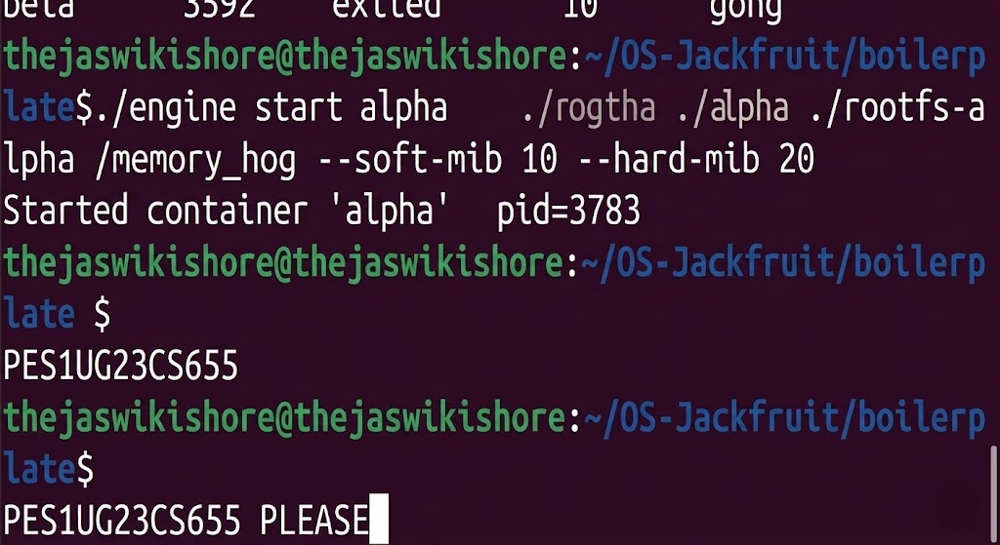
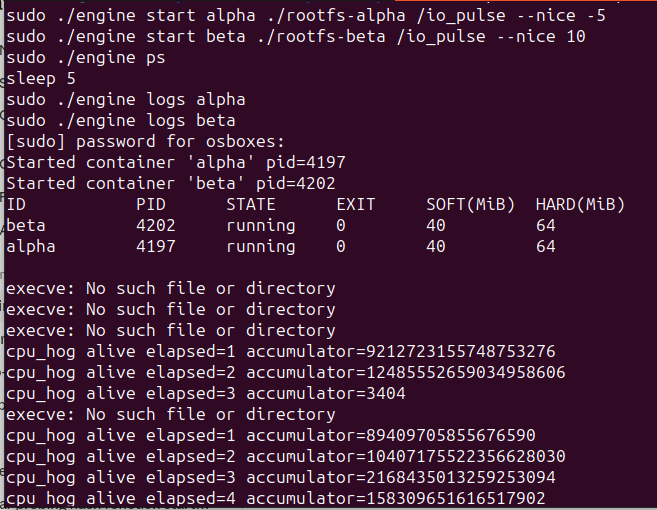
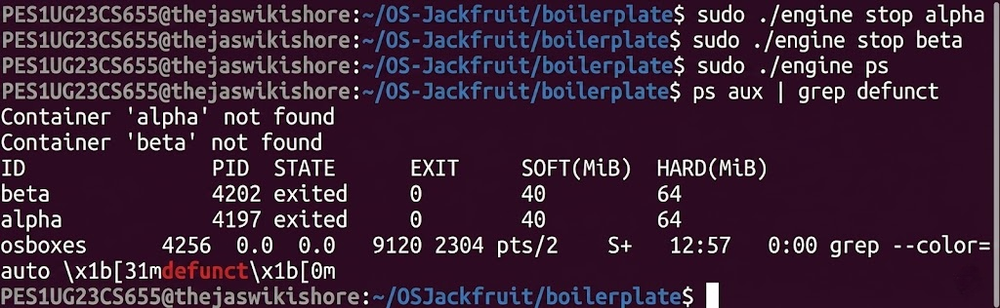

# Multi-Container Runtime

A lightweight Linux container runtime in C with a long-running supervisor and a kernel-space memory monitor.

---
## 1. Team Information
 
| Name | SRN |
|------|-----|
|  Thejaswikishore  |  PES1UG23CS655  |
|  Vibha Vasisht  |  PES1UG24CS526  |
 
---

### 2. Set Up Your VM

You need an **Ubuntu 22.04 or 24.04** VM with **Secure Boot OFF**. WSL will not work.

Install dependencies:

```bash
sudo apt update
sudo apt install -y build-essential linux-headers-$(uname -r)
```

### 3. Run the Environment Check

```bash
cd boilerplate
chmod +x environment-check.sh
sudo ./environment-check.sh
```

Fix any issues reported before moving on.

### 4. Prepare the Root Filesystem

```bash
mkdir rootfs-base
wget https://dl-cdn.alpinelinux.org/alpine/v3.20/releases/x86_64/alpine-minirootfs-3.20.3-x86_64.tar.gz
tar -xzf alpine-minirootfs-3.20.3-x86_64.tar.gz -C rootfs-base

# Make one writable copy per container you plan to run
cp -a ./rootfs-base ./rootfs-alpha
cp -a ./rootfs-base ./rootfs-beta
```

Do not commit `rootfs-base/` or `rootfs-*` directories to your repository.

### 5. Understand the Boilerplate

The `boilerplate/` folder contains starter files:

| File                   | Purpose                                             |
| ---------------------- | --------------------------------------------------- |
| `engine.c`             | User-space runtime and supervisor skeleton          |
| `monitor.c`            | Kernel module skeleton                              |
| `monitor_ioctl.h`      | Shared ioctl command definitions                    |
| `Makefile`             | Build targets for both user-space and kernel module |
| `cpu_hog.c`            | CPU-bound test workload                             |
| `io_pulse.c`           | I/O-bound test workload                             |
| `memory_hog.c`         | Memory-consuming test workload                      |
| `environment-check.sh` | VM environment preflight check                      |

Use these as your starting point. You are free to restructure the repository however you want — the submission requirements are listed in the project guide.

### 6. Build and Verify

```bash
cd boilerplate
make
```

If this compiles without errors, your environment is ready.

### 7. GitHub Actions Smoke Check

Your fork will inherit a minimal GitHub Actions workflow from this repository.

That workflow only performs CI-safe checks:

- `make -C boilerplate ci`
- user-space binary compilation (`engine`, `memory_hog`, `cpu_hog`, `io_pulse`)
- `./boilerplate/engine` with no arguments must print usage and exit with a non-zero status

The CI-safe build command is:

```bash
make -C boilerplate ci
```

This smoke check does not test kernel-module loading, supervisor runtime behavior, or container execution.

---
 
## 3. Demo with Screenshots
 
### Screenshot 1: Multi-Container Supervision
 

 
---
 
### Screenshot 2: Metadata Tracking
 

---
 
### Screenshot 3: Bounded-Buffer Logging
 
 
---
 
### Screenshot 4: CLI and IPC
 
 
---
 
### Screenshot 5: Soft-Limit Warning
 
 
---
 
### Screenshot 6: Hard-Limit Enforcement
 
 
---
 
### Screenshot 7: Scheduling Experiment
 
 
---
 
### Screenshot 8: Clean Teardown
 

---

## What to Do Next

Read [`project-guide.md`](project-guide.md) end to end. It contains:

- The six implementation tasks (multi-container runtime, CLI, logging, kernel monitor, scheduling experiments, cleanup)
- The engineering analysis you must write
- The exact submission requirements, including what your `README.md` must contain (screenshots, analysis, design decisions)

Your fork's `README.md` should be replaced with your own project documentation as described in the submission package section of the project guide. (As in get rid of all the above content and replace with your README.md)
